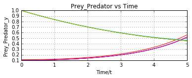
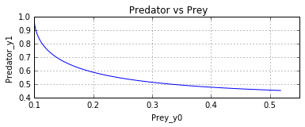
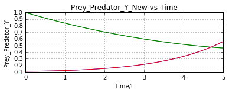
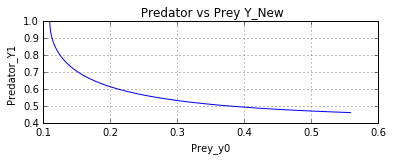

UECM3033 Assignment #3 Report
========================================================

- Prepared by: NgKeJie
- Tutorial Group: T2

--------------------------------------------------------

## Task 1 --  Gauss-Legendre formula

The reports, codes and supporting documents are to be uploaded to Github at: 

[https://github.com/NGKEJIE/UECM3033_assign3]

Explain how you implement your `task1.py` here.

In task 1, I need to define the Gauss-Legendre quadrature with the 20 nodes by using the function given "def gausslegendre (f,a,b,n=20)".
First, 	use the numpy.polynomial.legendre.leggauss to find the weight and nodes.
Second,	find the matrix xs and ws by repeating 20 times.
Third, 	use the xs to substitute into the function f(x) and into f(t) to get the answer.
Forth,	substitute xs in to the equation 0.5(x+1)(b-a)+a to find t.
Last,	find the integration answer by using gauss legendre quadrature.

Explain how you get the weights and nodes used in the Gauss-Legendre quadrature.

The weights and nodes can be get by importing numpy.polynomial.legendre.leggauss.
---------------------------------------------------------

## Task 2 -- Predator-prey model

Explain how you implement your `task2.py` here, especially how to use `odeint`.

In task 2, I need to define funcion of dy/dt that updates and return the new y0 and y1.
First,	initialise constant [a,b] to [1.0, 0.2] and define the function "[a(y[0]-y[0]y[1]),b(-y[1]+y[0]y[1])]".
Second,	set y as [0.1,1.0] and create 200 intervals between t0 and t5 by using np.linspace.
Third,	use integrate.odient to integrate the ODE system with input dy_dt,y,t.
Last,	plot the graph by using the function in matplotlib.pylot. 

Put your graphs here and explain.

Figure 1

Figure 2

Figure1 shows the population of Prey and Predator against time and Figure 2 show the population of Predator againts population of Prey. The green line is Prey and the red line is Predator. 
At the begining, the prey is very low population and the the predator is very high population. The population of prey is not enough for the predator, so the population of predator decreases.
As the time increases, the population of prey increases but the population of predator decreases. This result show that the population of prey is inversly propotional to the population of predator.

Is the system of ODE sensitive to initial condition? Explain.

Figure 3

Figure 4

NO, Figure 3 and Figure 4 show similiar with Figure 1 and Figure 2, although the condition y change from [0.1,1.0] to [0.11,1.0].

-----------------------------------

last modified: 17/4/2016
